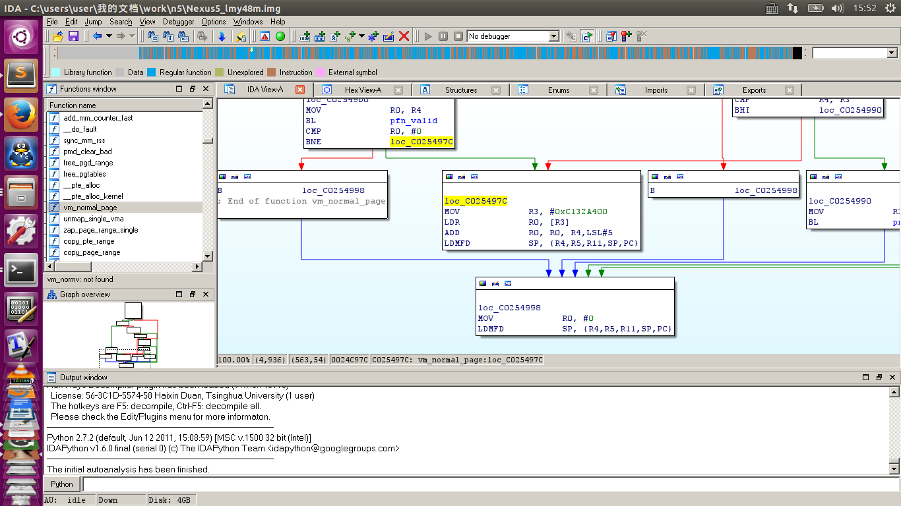

#AMExtractor = Android Memory Extractor#

In short, AMExtractor can dump out the physical content of your Android device even without kernel source code.

# Introduction #

Memory forensic tools provide a thorough way to detect malwares and ferret out cyber crimes. [LiME](https://github.com/504ensicsLabs/LiME) is very popular among community. But LiME and similar LKM based tools cannot be used without target source code or LKM support. 

As far as I know, stock ROM of Nexus series doesn't support LKM at all; Samsung Galaxy series has a sanity check and won't allow unofficial modules.

Rather than LKM, AMExtractor use /dev/kmem to run code in kernel space. AMExtractor is tested on several devices shipped with different versions of Android, including Galaxy Nexus, Nexus 4, Nexus 5, Samsung Galaxy S4.

#HOW TO USE#

0. You need ROOT access.

1. Define target phone's configuration in config.h. 

Now there are preset config of Galaxy Nexus, Nexus4, Nexus 5, Samsung Galaxy S4(I9500).

You need to figure out three options:

* memory model: one of FLAT_MEM, SPARSE_MEM and DISCONTIG_MEM.

* sizeof(struct page): Typical size is 32.

* trigger method: one of USE_SYNC_PTMX or USE_SEEK_ZERO

You can figure out the configuration by reverse engineering target kernel image. 

Take Nexus 5 for example, 

find the address of vm_normal_page:

    root@hammerhead:/data/local/tmp # grep vm_normal_page /proc/kallsyms  
    c025492c T vm_normal_page

And unpack and disassemble the kernel image, locate on vm_normal_page:

demo.png

At the end of vm_normal_page function, there is the implementation of pfn_to_page():

    MOV             R3, #0xC132A400
    LDR             R0, [R3]
    ADD             R0, R0, R4,LSL#5
    LDMFD           SP, {R4,R5,R11,SP,PC}

The #0xC132A400 is the address of mem_map . It can be seen that the memory model is FLAT_MEM, and the sizeof(struct page) is 32.

So define the macro in config.h:

    #define FLAT_MEM
    #define STRUCT_PAGE_SIZE 32
    #define USE_SYNC_PTMX

2. Compile and push

    user@user-X240s:~/AMExtractor$ ndk-build NDK_PROJECT_PATH=. APP_BUILD_SCRIPT=Android.mk

    user@user-X240s:~/AMExtractor$ adb push libs/armeabi/AMExtractor /data/local/tmp

    user@user-X240s:~/AMExtractor$ adb shell
    shell@hammerhead:/ $ su
    root@hammerhead:/ # chmod 777 AMExtrator 

3. Test and Run

First test execution in kernel.

    root@hammerhead:/data/local/tmp # ./AMExtrator 
    root@hammerhead:/data/local/tmp # dmesg
    .....
    <4>[40997.151646] Hello kmem...
    <4>[40999.651282] Hello kmem...
    .....

That means code has been executed in kernel.

Then start dump:

on Android side:

    root@hammerhead:/data/local/tmp # ./AMExtrator -d   

on PC side:

    user@user-X240s:~/AMExtractor$ adb forward tcp:31415 tcp:31415
    user@user-X240s:~/AMExtractor$ nc 127.0.0.1 31415 > dump

    
dump the name of memory image.

